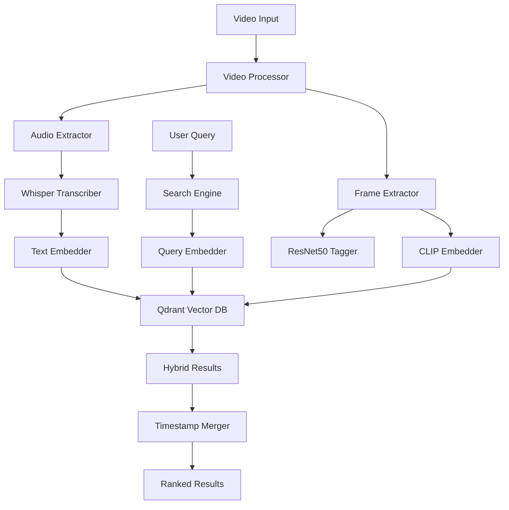

# ClipCompass Architecture

## System Overview

ClipCompass is a **Multi-Modal Video-Context Search Engine** that enables natural language search across both audio transcripts and visual frames in video content. The system demonstrates advanced engineering capabilities in handling unstructured, multi-modal data pipelines.

---

## High-Level Architecture



---

## Core Components

### 1. Video Processing Pipeline

#### **Video Processor** (`app/services/video_processor.py`)
Orchestrates the entire processing workflow:

```python
async def process_video(video: Video):
    1. Extract audio (FFmpeg)
    2. Transcribe with Whisper (word-level timestamps)
    3. Extract frames (1 FPS, configurable)
    4. Tag frames with ResNet50
    5. Generate embeddings (text + image)
    6. Store in Qdrant vector database
```

**Key Innovation**: All operations maintain precise timestamps for synchronization.

#### **Audio Extraction** (`app/services/audio_extractor.py`)
- Uses FFmpeg to extract audio track
- Converts to 16kHz mono WAV (Whisper requirement)
- Preserves original video for playback

#### **Frame Extraction** (`app/services/frame_extractor.py`)
- Extracts frames at configurable FPS (default: 1 FPS)
- Saves frames as JPEG with timestamps
- Supports scene change detection (optional)

---

### 2. AI/ML Models

#### **Whisper Transcriber** (`app/services/transcriber.py`)
- **Model**: OpenAI Whisper (base model by default)
- **Output**: Word-level timestamps + speaker segments
- **Chunking**: Combines segments into 10-second chunks for embedding
- **Language**: Auto-detection (supports 99 languages)

**Example Output**:
```json
{
  "text": "Let's review the Q4 revenue projections",
  "start": 45.2,
  "end": 48.7,
  "words": [
    {"word": "Let's", "start": 45.2, "end": 45.5},
    {"word": "review", "start": 45.6, "end": 45.9},
    ...
  ]
}
```

#### **CLIP Embedder** (`app/services/embedder.py`)
- **Model**: OpenAI CLIP ViT-B/32
- **Purpose**: Generate 512-dim embeddings for frames
- **Capability**: Understands image-text similarity
- **Use Case**: Search for visual concepts ("person presenting", "chart with bars")

#### **Text Embedder**
- **Model**: Sentence-Transformers (all-MiniLM-L6-v2)
- **Purpose**: Generate 384-dim embeddings for transcripts
- **Optimized**: Fast inference, good semantic understanding

#### **ResNet50 Tagger** (`app/services/tagger.py`)
- **Model**: Pre-trained ResNet50 (ImageNet)
- **Purpose**: Auto-tag frames with visual concepts
- **Output**: Top-5 predictions per frame (e.g., "laptop", "conference_room", "whiteboard")

---

### 3. Vector Database (Qdrant)

#### **Collections**
1. **transcript_embeddings**
   - Stores text embeddings (384-dim)
   - Payload: `{text, start_time, end_time, video_id, speaker}`

2. **frame_embeddings**
   - Stores image embeddings (512-dim)
   - Payload: `{frame_path, timestamp, video_id, caption, tags}`

#### **Why Qdrant?**
- High-performance vector similarity search
- Supports filtering (by video_id, timestamp range)
- Scalable to millions of vectors
- HNSW indexing for fast retrieval

---

### 4. Multi-Modal Search Engine

#### **Search Types**

**1. Transcript Search**
```python
query = "budget discussion"
→ Embed query with text model (384-dim)
→ Search transcript_embeddings collection
→ Return segments with timestamps
```

**2. Frame Search**
```python
query = "person presenting slides"
→ Embed query with CLIP text encoder (512-dim)
→ Search frame_embeddings collection
→ Return frames with timestamps
```

**3. Hybrid Search** (The Innovation)
```python
query = "show the slide when they mentioned revenue"
→ Search both collections
→ Merge results by timestamp proximity (±5 seconds)
→ Return combined results with transcript + frame
```

#### **Timestamp Synchronization**

The core challenge: aligning audio and visual data.

**Algorithm**:
```python
def merge_results(transcript_results, frame_results):
    merged = []
    for t_result in transcript_results:
        for f_result in frame_results:
            if abs(t_result.timestamp - f_result.timestamp) <= 5.0:
                # Combine into single result
                merged.append({
                    "transcript": t_result.text,
                    "frame": f_result.image_path,
                    "timestamp": t_result.timestamp,
                    "score": max(t_result.score, f_result.score)
                })
    return merged
```

**Why This Matters**:
- Enables queries that span modalities
- Provides richer context (see what was shown while hearing what was said)
- Mimics human understanding of video content

---

## Data Flow

### Upload & Processing
```
1. User uploads video → FastAPI endpoint
2. Save to disk → Create DB record (status: PENDING)
3. Trigger Celery task (async background processing)
4. Update status: EXTRACTING_AUDIO → TRANSCRIBING → EXTRACTING_FRAMES → EMBEDDING
5. Store embeddings in Qdrant
6. Update status: READY
```

### Search Query
```
1. User enters query → Frontend
2. POST /api/v1/search?q=query&search_type=hybrid
3. Backend embeds query (text + CLIP)
4. Query Qdrant collections
5. Merge results by timestamp
6. Rank by similarity score
7. Return top-N results with metadata
```

---

## Database Schema

### SQLite Tables

**videos**
```sql
CREATE TABLE videos (
    id TEXT PRIMARY KEY,
    title TEXT,
    file_path TEXT,
    duration_seconds REAL,
    status TEXT,  -- PENDING, PROCESSING, READY, FAILED
    processing_progress INTEGER,
    uploaded_at TIMESTAMP,
    processed_at TIMESTAMP
);
```

**transcript_segments**
```sql
CREATE TABLE transcript_segments (
    id INTEGER PRIMARY KEY,
    video_id TEXT,
    segment_index INTEGER,
    start_time REAL,
    end_time REAL,
    text TEXT,
    speaker TEXT,
    embedding_id TEXT  -- Qdrant point ID
);
```

**frames**
```sql
CREATE TABLE frames (
    id INTEGER PRIMARY KEY,
    video_id TEXT,
    frame_index INTEGER,
    timestamp REAL,
    file_path TEXT,
    tags TEXT,  -- JSON array
    embedding_id TEXT  -- Qdrant point ID
);
```

---

## Performance Optimization

### Processing Speed
- **Bottleneck**: Whisper transcription (CPU-bound)
- **Solution**: Use GPU-enabled containers (`whisper.load_model(device="cuda")`)
- **Benchmark**: 5-minute video processes in ~3 minutes (CPU), ~1 minute (GPU)

### Search Latency
- **Target**: <500ms for hybrid queries
- **Optimization**: 
  - HNSW indexing in Qdrant
  - Limit search to top-K results (default: 10)
  - Filter by video_id when searching single video

### Storage
- **Frames**: ~1 frame/second → 300 frames for 5-min video → ~15MB
- **Embeddings**: 
  - Transcript: ~30 chunks × 384 dims × 4 bytes = ~46KB
  - Frames: 300 frames × 512 dims × 4 bytes = ~614KB
- **Total**: ~16MB per 5-minute video

---

## Scalability Considerations

### Horizontal Scaling
1. **Celery Workers**: Scale processing by adding workers
2. **Qdrant Cluster**: Shard collections across nodes
3. **Load Balancer**: Distribute API requests

### Vertical Scaling
1. **GPU Acceleration**: 3-5x faster processing
2. **Batch Processing**: Process multiple videos in parallel
3. **Model Optimization**: Use quantized models (INT8)

---

## Security & Privacy

### Current Implementation (Development)
- No authentication (open API)
- Local file storage
- CORS: Allow all origins

### Production Recommendations
1. **Authentication**: JWT tokens, API keys
2. **Storage**: S3/Cloud Storage with signed URLs
3. **CORS**: Whitelist specific domains
4. **Rate Limiting**: Prevent abuse
5. **Data Encryption**: Encrypt sensitive video content

---

## Future Enhancements

### Planned Features
1. **Speaker Diarization**: Identify who said what
2. **Scene Change Detection**: Extract keyframes intelligently
3. **Real-time Processing**: WebSocket progress updates
4. **Multi-language UI**: Support for non-English queries
5. **Advanced Filters**: Search by date, speaker, video type

### Research Directions
1. **Temporal Modeling**: Understand video sequences (not just frames)
2. **Action Recognition**: Detect activities ("person walking", "handshake")
3. **OCR Integration**: Extract text from slides/whiteboards
4. **Audio Events**: Detect laughter, applause, music

---

## Comparison: Text RAG vs. Video RAG

| Aspect | Text RAG | Video RAG (ClipCompass) |
|--------|----------|-------------------------|
| **Input** | Documents (PDF, TXT) | Videos (MP4, YouTube) |
| **Modalities** | Single (text) | Dual (audio + visual) |
| **Embedding** | Text encoder | Text + CLIP encoders |
| **Synchronization** | N/A | Timestamp alignment |
| **Complexity** | Low | High |
| **Use Cases** | Q&A, summarization | Meeting search, training videos |

**Key Takeaway**: Video RAG requires solving multi-modal synchronization—a significantly harder engineering problem.

---

## Conclusion

ClipCompass demonstrates:
1. **Multi-modal data handling**: Audio + visual synchronization
2. **Production-ready pipeline**: Async processing, error handling, progress tracking
3. **Scalable architecture**: Vector DB, background tasks, API design
4. **Real-world application**: Solves enterprise problem (searchable video archives)

This is not a toy project—it's a complete system that showcases advanced ML engineering skills.
